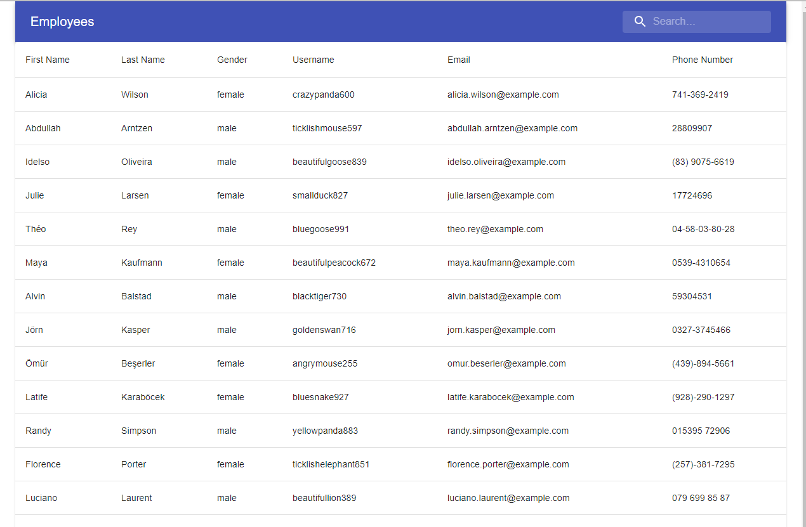

# Employee Viewer

## Description
Pulls up a list of employees and allows the user to sort and filter the items on the grid.

[Live Demo](https://heavensregent.github.io/nb-w19-homework-error/)
[Github URL](https://github.com/HeavensRegent/nb-w19-homework-error)

## Table of Contents
* [Installation Instructions](<#installation-instructions>)
* [Usage Information](<#usage-information>)
* [Collaborators](<#collaborators>)
* [Contribution Guidelines](<#contribution-guidelines>)
* [Test Instructions](<#test-instructions>)
* [License](<#license>)
* [Questions](<#questions>)

## Installation Instructions
yarn install / npm i

## Usage Information
yarn start / npm run start

## Collaborators
[https://github.com/HeavensRegent](https://github.com/HeavensRegent)

## Contribution Guidelines
Forking and pull requests

## Test Instructions
None

## License
MIT License

## Questions
View my Github Profile at [https://github.com/HeavensRegent](https://github.com/HeavensRegent)

Contact me at blstarwars1@gmail.com
